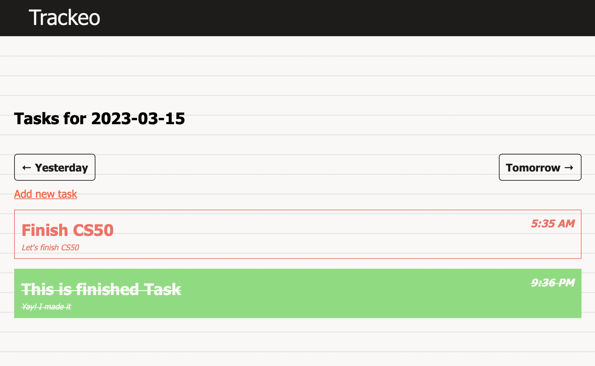

# Trackeo

A Trackeo is a tool that can help you organize and keep track of the tasks that you need to complete in a given day. It is a visual representation of your to-do list, where you can see all your tasks in one place and track your progress as you complete them.

  

### [Video demo](https://www.youtube.com/watch?v=pKVRD0kWtTA)

## Requirements
`Ruby 3.1.0`

## Instalation
- Clone this repo
- Install dependecies `bundle install`
- Create database `rails db:create`
- Migrate database `rails db:migrate`

## Tests

- Tests framework used for this app is `rspec`
- To run all tests at once use command `rspec`
- To check current code coverage `open coverage/index.html`
- To run rubocop check `rubocop`

## Running

You can run this application with `rails s` or `rails server`

Default url: `http://127.0.0.1:3000`